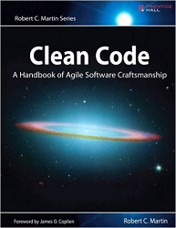

# CLEAN CODE

Documentación extraida del libro [Clean Code](https://www.amazon.com/Clean-Code-Handbook-Software-Craftsmanship/dp/0132350882) escrito por Robert C. Martin, y publicado en 2005.

En este libro se recogen una serie consejos y buenas prácticas extraidas a partir de las experiencias de algunos desarrolladores de gran prestigio.
El libro supuso un cambio en la mentalidad de como entender el desarrollo de software para muchas personas y a día de hoy muchos lo siguen considerando la biblia de la informática.

### Índice
- [Consejos](./Consejos)
- [Formato](./Formato)
- [Métodos](./Metodos)
- [Clases](./Clases)
- [Objetos y estructuras de datos](./ObjetosYEstructurasDeDatos)
- [Las normas de Kent Beck](./KentBecksRules)
- [La ley de Demeter](./LaLeyDeDemeter)
- [Train wrecks](./TrainWrecks)
- [The boy scout rule](./BoyScoutRule)
- [Sistemas](./Sistemas)
- [Tests unitarios](./TestsUnitarios)
- [Concurrencia](./Concurrencia)
- [Conceptos](./Conceptos)
